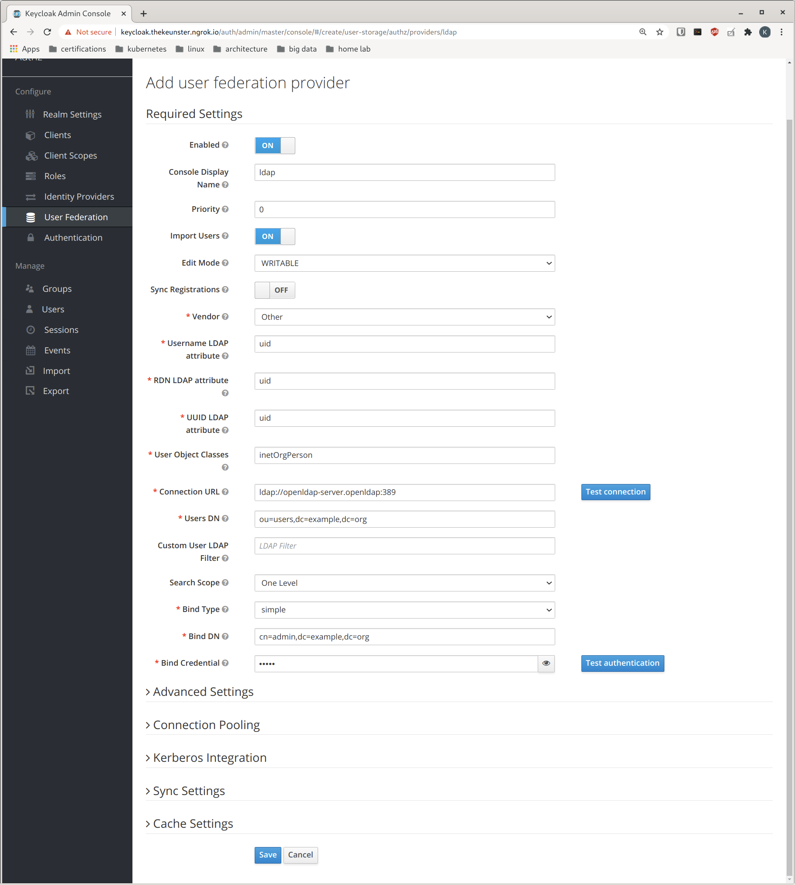
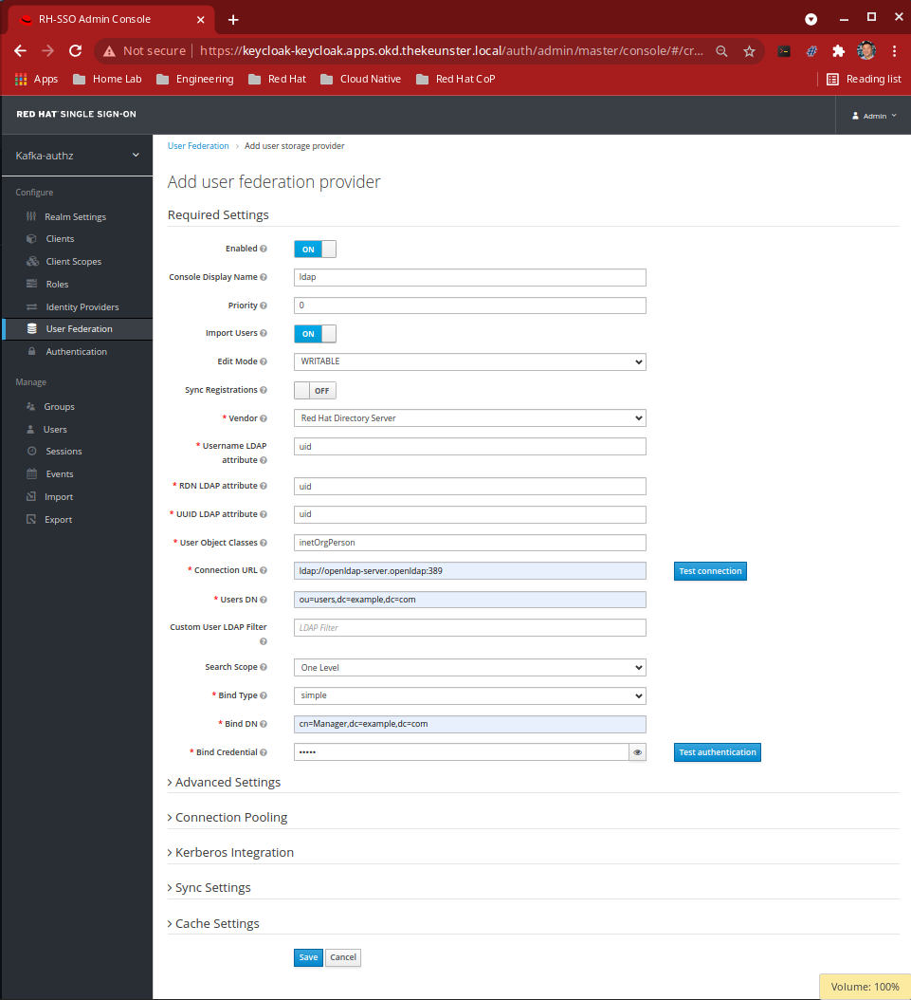
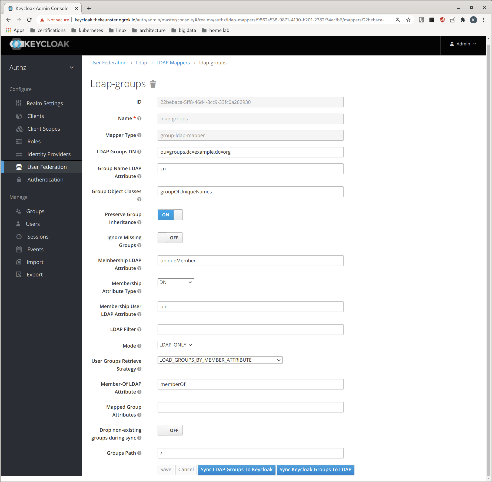
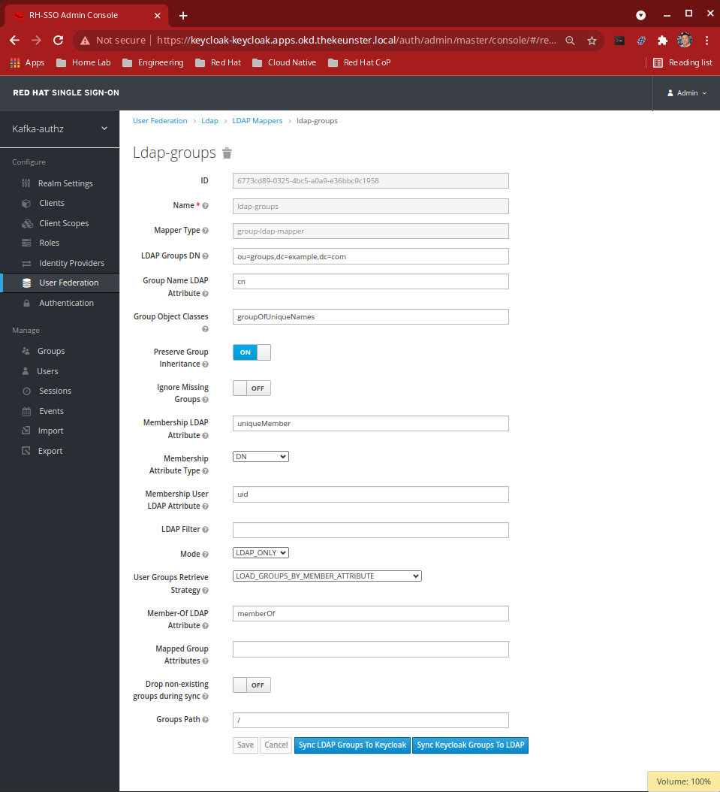
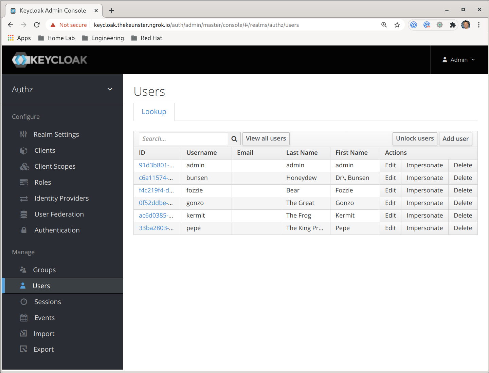

# Keycloak LDAP Setup

## Open the Keycloak Administration Dashboard

You can access the keycloak web ui a few different ways. 

### Kubernetes

#### Leveraging a Port Forward Proxy

one way to do to this is via port-forwarding your keycloak pod. 

```bash
# example - accessible at: https://localhost:8443
# obtain keycloak pod name. i.e. keycloak-69689547-fmn6h
kubectl -n keycloak port-forward keycloak-69689547-fmn6h 8443:8443
```

#### Go directly to the external address exposed by your load balancer service

This may not work for you depending on your cluster setup. Otherwise, you will need to proxy the address using port-forward or other means of forwarding (i.e. ngrok, etc.) -- see first option.

```bash
# this will list your services
# under external address, you should see an IP, 
# provided you have enabled load balancers in your cluster
# navigate to: https://<EXTERNAL-ADDRES>:8443
kubectl -n keycloak get svc keycloak
```

### Openshift

```bash
# open the url route to the Keycloak Web UI
# navigate to the route displayed after running the following command
oc -n keycloak get routes keycloak -o jsonpath='{ .spec.host }'
```

## Add an LDAP Provider and Import Users

1) Login to the main Keycloak dashboard

```bash
# Keycloak u/p
username: admin
password: admin
```

2) Select realm: `kafka-authz`

3) Select `User Federation` and then `ldap` from the provider drop down

4) Match your screen configuration to the illustration below

    > We are using the following masked values in the form as shown in the illustration: `Bind Credential: admin`

    *Keycloak on Kubernetes*

    Vendor: `Other`

    Users DN: `ou=users,dc=example,dc=org`

    Bind DN: `cn=admin,dc=example,dc=org`

    

    *RH SSO on Openshift*

    Vendor: `Red Hat Directory Server`

    Users DN: `ou=users,dc=example,dc=com`

    Bind DN: `cn=Manager,dc=example,dc=com`

    

We are using OpenLDAP as our LDAP provider in this example, hence the screen configurations will be specific to configuring OpenLDAP. 

Between other LDAP Providers, these configurations will differ.

5) click `save`, then click `Synchronize all users`

> All defined LDAP users in this example have password: `pass`

## Import LDAP Groups

1) select `User Federation` and then `ldap` 
2) select `Mappers`
3) click `create` and set name: `ldap-groups` and select mapper-type: `group-ldap-mapper`
4) fill the form in with the following values: 

    **Keycloak on Kubernetes**

    LDAP Groups DN: `ou=groups,dc=example,dc=org`

    

    **RH SSO on Openshift**

    LDAP Groups DN: `ou=groups,dc=example,dc=com`

    

5) click `save` and then `Sync LDAP Groups to Keycloak`

You can validate our LDAP users and groups by clicking on the `Users` and `Groups` tabs. 

You should see the following users: 



and groups: 


